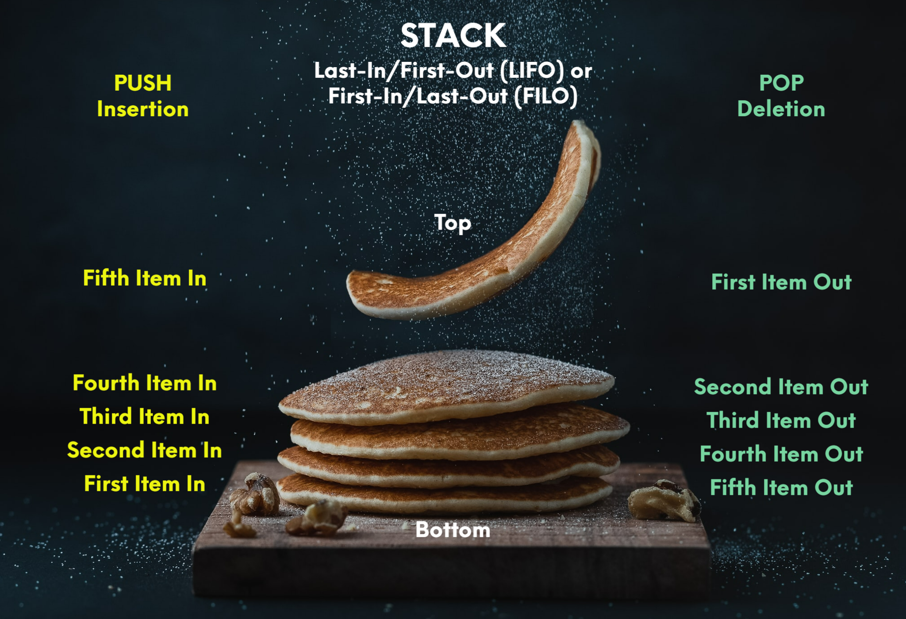

# Stack

## Introduction
A stack is a list that follows the **Last-In/First-Out (LIFO) or First-In/Last-Out (FILO)** method. This simply means that the first item in the stack goes to the left side of the list and the next item added goes to the index slot to the right of the first item and so forth. I have 10 kids and so the analogy of a stack of pancakes is very easy to understand. The first pancake that comes off the pan goes onto the plate and the second one goes onto the first pancake and so forth. When the kids come in, the take the last pancake that I put on the stack and then the next and so forth. The adding or inserting of an item into a stack is called **push** and the removing or deleting of an item is called **pop**.



## Functions associated with stack

Here is s list of the functions that would be used to accomplish the desired operation.

| Stack Operation | Description                   | Python Code            |
| :-------------: | :---------------------------: | :--------------------: |
| empty()         | If the stack is empty         | if len(my_stack) == 0: |
| size()          | The size of the stack         | length = len(my_stack) |
| push()          | Inserts an item into a stack  | my_stack.append(value) |
| pop()           | Deletes an item into a stack  | value = my_stack.pop() |

## How to implement stack (List)

To implement a stack in Python, you would use a list. 
```python
# This is how you decalre an empty stack
stack = [] 
```
The adding or inserting of an item into a stack is called **push** and in Python to push and item, you would use the **append** function. The removing or deleting of an item is called **pop** and you would use the **pop** function. 

- New stack - stack = []
- Add to stack - stack.append(item)
- Remove from stack - stack.pop()

See the below example  to better understand how it all works together.

## Example

```python
# This is how you decalre an empty stack
stack = []

# The append function is used to add/push an item to the stack.
# element in the stack
stack.append('plain_pancake')
stack.append('blueberry_pancake')
stack.append('chocolate_chip_pancake')

# Prints out what the Pancake stack looks like now
print('Pancake stack')
print(stack)

# The pop function is used to remove/pop an item from the stack.
print('\nFirst kid eats a pancake from the top of the stack, which one was eaten?')
print(stack.pop())

print('\nSecond kid eats a pancake from the top of the stack, which one was eaten?')
print(stack.pop())

print('\nThird kid eats a pancake from the top of the stack, which one was eaten?')
print(stack.pop())

print('\nPancake stack after kids are done eating:')
print(stack)

print('\nThats right, pancakes are now gone.')

# To recap:
# append adds items to the stack 
# and pop removes items from the stack.
```

## Problem to Solve

You have a bag filled with fruits and veggies and you need to seperate the fruits and the veggies and put them into their own bags. Work therough the below problem and when you have finished, compare your code with the solution code:

[Go to the problem](/s-problem_solution.py)

```python
'''
Remove the items from the bag and then sort the fruits into the fruits_bag and the veggies into the veggies_bag.
'''

def sorter(list):
  bag = list
  fruit_bag = []
  veggies_bag = []
  
  #Enter code here
  pass
    
  print(f'Bag: {bag}')
  print(f'Fruit Bag: {fruit_bag}')
  print(f'Veggies Bag: {veggies_bag}')

sorter(['bananas', 'cucumbers', 'grapes', 'apples', 'carrots', 'celery', 'strawberies'])

'''
Expected results:
Bag: []
Fruit Bag: ['strawberies', 'apples', 'grapes', 'bananas']
Veggies Bag: ['celery', 'carrots', 'cucumbers']
'''
```

You can check your code with the solution here: [Solution](/s-problem_solution.py)

[Back to Welcome Page](/0-welcome.md)