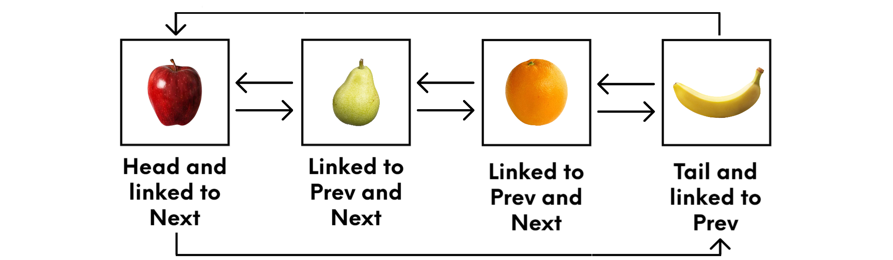

# Linked Lists

## Introduction

A linked list in is a very powerful way to store and organize data. You are most likely familiar with a standard list, which is simply a list of items. For example, here is a list of fruit: [apples, pears, oranges, bananas]. A standard list is filled in order and each item is placed in an index starting with 0 and going up by 1 with each item. 

There is no linking of indexes, because they are all already linked and if an item is removed the other items shift over to fill in that gap. With a linked list, there are not indexes, but rather each item is linked with other items in the list. So, the first or head item is linked to the next item and last or tail item. The last or tail item is linked to the previous item and the head item. All the inbetween items are each linked to the previous and next items as seen in the below figure.



There are single linking lists which only link to the next item and then there are double linked lists which link to both the previous and next items in the list. This linking acts like a pointer, pointing to where the item is stored in memory. When an item is removed from this type of a list, all you do is connect the remaining items together. This puts the focus on the content of the list rather than the indexes. Also, like standard lists, linked lists allow for duplicated items, which sets them apart from other types of lists known as sets or dictionaries. 

## Performance

You may ask, why do all these different lists really matter so much? The answer to that question is really two-fold, functionality and performance or speed. We have already discussed the differences in functionality at a very high level, but when it comes to speed, with large sets, a linked list will perform faster than the others. With small lists, there is not a huge difference, but the larger the list, the more important performance and speed factor into the solution that will be created, and the list type chosen. 

Programming a linked list is more involved than a standard list, set, or dictionary. With a Linked list you can either cycle through or iterate through the list forward or in reverse order and remember that you must link up the item to the other items on either side of it in memory. 
 
This ensures that the operations are fast in the beginning and at the end of the operation. They achieve a performance rating of O(1) at both of these times, which is what all code shoots for in terms of performance.

## Create a Linked List

You will need to follow a few steps to create a linked list. 
1. Create a class for your linked list. Be sure to create the start of your linked list which is known as the head.
```python
class LList:
    def __init__(self):
        self.head = None
```
2. Create the nodes of your linked list. Think of these nodes like the indexes in a regular list. They are different because you must specify how to connect the nodes in your linked list. In the below code, we specify a connection to the next node in the linked list, which means that this is a single linking list. **To create a double linking list you need to add `self.previous = None` below the `self.next = None` line.**
```python
class Node:
    def __init__(self, data):
        self.data = data
        self.next = None
```

## Insert into a Linked List
Using a a while loop as seen below will add values to the linked list. See Example 1 to see it in action.

```python
# __repr__ this stands for representation and is used to get a printable representation of an object.
def __repr__(self):
        # First node is the head node
        node = self.head

        # Create an empty linked list
        all_nodes = []

        # As long as the first node is not empty, add node data to the linked list
        while node is not None:
            all_nodes.append(node.data)
            node = node.next
        all_nodes.append('None')
        return ' --> '.join(all_nodes)
  ```

## Example 1
In this example you can see how the node link to the next node. You will see an arrow (-->), indicating the node is connected to the next node or if there are not any nodes left, you  will see (None).

```python
class Node:
    def __init__(self, data):
        self.data = data
        self.next = None

    def __repr__(self):
        return self.data

class LinkedList:
    def __init__(self):
        self.head = None

    def __repr__(self):
        # First node is the head node
        node = self.head

        # Create an empty linked list
        all_nodes = []

        # As long as the first node is not empty
        # Add node data to list
        while node is not None:
            all_nodes.append(node.data)
            node = node.next
        all_nodes.append('None')
        return ' --> '.join(all_nodes)


llist = LinkedList()
print(llist)
# Expected Results
# None

node1 = Node('apple')
llist.head = node1
print(llist)
# Expected Results
# apple --> None


node2 = Node('banana')
node3 = Node('grape')
node1.next = node2
node2.next = node3
print(llist)
# Expected Results
# apple --> banana --> grape --> None
```
Now that you have seen how to insert values into a linked list, let's now setup functions to do this. With linked lists, there are really four ways to insert. 
- Insert at the begining
- Insert at the end
- Insert after a node
- Insert before a node
  
 Here are the functions that will do these for you.

### Insert at the Beginning
```python
def add_beginning(self, node):
    node.next = self.head
    self.head = node
```

### Insert at the End
```python
def add_end(self, node):
    if self.head is None:
        self.head = node
        return
    for current_node in self:
        pass
    current_node.next = node
```
### Insert After a Node
```python
def add_after(self, value, new_node):
    if self.head is None:
        raise Exception('List is empty')

    for node in self:
        if node.data == value:
            new_node.next = node.next
            node.next = new_node
            return

    raise Exception('Node with data '%s' not found' % value)
```

### Insert Before a Node
```python
def add_before(self, value, new_node):
    if self.head is None:
        raise Exception('List is empty')

    if self.head.data == value:
        return self.add_beginning(new_node)

    prev_node = self.head
    for node in self:
        if node.data == value:
            prev_node.next = new_node
            new_node.next = node
            return
        prev_node = node

    raise Exception('Node with data '%s' not found' % value)
```
## Remove from a Linked List
When removing from a linked list, there is not a specific remove prompt like ```pop()```. What happens here, is that you simply replace the nodes data and relink it to the other nodes and that is what delets the old data. 

```python
def remove_node(self, value):
    if self.head is None:
        raise Exception('List is empty')

    if self.head.data == value:
        self.head = self.head.next
        return

    previous_node = self.head
    for node in self:
        if node.data == value:
            previous_node.next = node.next
            return
        previous_node = node

    raise Exception('Node with data '%s' not found' % value)
```

## Traverse Through a Linked List
Traversing through a linked list is really the same things as interating through that list. 

```python
def __iter__(self):
    node = self.head
    while node is not None:
        yield node
        node = node.next
```

Now you can use a for loop like this to print off the nodes:

```python
for node in llist:
    print(node)
```

## Search a Linked List
To get data out of a linked list, you need to search the list. This code will search the linked list and returns a Node with the given value or it will return None.

```python
def search(self, value):
  '''
  Search the linked list and returns a Node with the given value or it will return None.
  '''
  node = self.head
  while node is not None:
      if node.data == value:
        print(node)
        return node
      node = node.next
  return None
```

## Example 2
This example brings all the code together so you can see it all together. 

```python
class Node:
    def __init__(self, data):
        self.data = data
        self.next = None

    def __repr__(self):
        return self.data

class LinkedList:
  def __init__(self, nodes=None):
    self.head = None
    if nodes is not None:
        node = Node(data=nodes.pop(0))
        self.head = node
        for elem in nodes:
            node.next = Node(data=elem)
            node = node.next

  def __repr__(self):
    """
    This stands for representation and is used to get a printable representation of an object.
    """
    # First node is the head node
    node = self.head

    # Create an empty linked list
    all_nodes = []

    # As long as the first node is not empty, add node data to the linked list
    while node is not None:
        all_nodes.append(node.data)
        node = node.next
    all_nodes.append("None")
    return " --> ".join(all_nodes)
    
  def add_beginning(self, node):
    """
    Inserts a node at the beginning of the linked list.
    """
    node.next = self.head
    self.head = node

  def add_end(self, node):
    """
    Inserts a node at the end of the linked list.
    """
    if self.head is None:
        self.head = node
        return
    for current_node in self:
        pass
    current_node.next = node

  def add_after(self, value, new_node):
    """
    Inserts a node after the given value
    """
    if self.head is None:
        raise Exception("List is empty")

    for node in self:
        if node.data == value:
            new_node.next = node.next
            node.next = new_node
            return

    raise Exception("Node with data '%s' not found" % value)

  def add_before(self, value, new_node):
    """
    Inserts a node before the given value
    """
    if self.head is None:
        raise Exception("List is empty")

    if self.head.data == value:
        return self.add_beginning(new_node)

    prev_node = self.head
    for node in self:
        if node.data == value:
            prev_node.next = new_node
            new_node.next = node
            return
        prev_node = node

    raise Exception("Node with data '%s' not found" % value)

  def __iter__(self):
    """
    Traverse or interate through the linked list.
    """
    node = self.head
    while node is not None:
        yield node
        node = node.next

  def remove_node(self, value):
    """
    Remove by replacing the nodes data and relink it to the other nodes.
    """
    if self.head is None:
        raise Exception("List is empty")

    if self.head.data == value:
        self.head = self.head.next
        return

    previous_node = self.head
    for node in self:
        if node.data == value:
            previous_node.next = node.next
            return
        previous_node = node

    raise Exception("Node with data '%s' not found" % value)

  def search(self, value):
    """
    Search the linked list and returns a Node with the given value or it will return None.
    """
    node = self.head
    while node is not None:
        if node.data == value:
            return node
        node = node.next
    return None

############
# Examples #
############
print('\n=========== Insert into a Linked List ===========')
# Without using the functions add_beginning, add_end, add_after, and add_before
my_ll = LinkedList()
print(my_ll)
# Expected Results
# None

node1 = Node('a')
my_ll.head = node1
print(my_ll)
# Expected Results
# apple --> None


node2 = Node('b')
node3 = Node('c')
node1.next = node2
node2.next = node3
print(my_ll)
# Expected Results
# apple --> banana --> grape --> None

print('\n=========== Insert at the Beginning ===========')
my_ll = LinkedList()
print(my_ll)
# Expected Results
# None

my_ll.add_beginning(Node('b'))
print(my_ll)
# Expected Results
# b -> None

my_ll.add_beginning(Node('a'))
print(my_ll)
# Expected Results
# a -> b -> None

print('\n=========== Insert at the End ===========')
my_ll = LinkedList(['a', 'b', 'c', 'd'])
print(my_ll)
# Expected Results
#a -> b -> c -> d -> None

my_ll.add_end(Node('e'))
print(my_ll)
# Expected Results
#a -> b -> c -> d -> e -> None

my_ll.add_end(Node('f'))
print(my_ll)
# Expected Results
#a -> b -> c -> d -> e -> f -> None

print('\n=========== Insert After a Node ===========')
my_ll = LinkedList()
# my_ll.add_after('a', Node('b')) # Uncomment this out to test it
# Expected Results
#Exception: List is empty

my_ll = LinkedList(['a', 'b', 'c', 'd'])
print(my_ll)
# Expected Results
#a -> b -> c -> d -> None

my_ll.add_after('c', Node('cc'))
print(my_ll)
# Expected Results
#a -> b -> c -> cc -> d -> None

# my_ll.add_after('f', Node('g')) # Uncomment this out to test it
# Expected Results
#Exception: Node with data 'f' not found

print('\n=========== Insert Before a Node ===========')
my_ll = LinkedList()
# my_ll.add_before('a', Node('a')) # Uncomment this out to test it
# Expected Results
#Exception: List is empty

my_ll = LinkedList(['b', 'c'])
print(my_ll)
# Expected Results
#b -> c -> None

my_ll.add_before('b', Node('a'))
print(my_ll)
# Expected Results
#a -> b -> c -> None

my_ll.add_before('b', Node('aa'))
my_ll.add_before('c', Node('bb'))
print(my_ll)
# Expected Results
#a -> aa -> b -> bb -> c -> None

# my_ll.add_before('n', Node('m')) # Uncomment this out to test it
# Expected Results
#Exception: Node with data 'n' not found

print('\n=========== Remove from a Linked List ===========')
my_ll = LinkedList()
# my_ll.remove_node('a') # Uncomment this out to test it
# Expected Results
# Exception: List is empty

my_ll = LinkedList(['a', 'b', 'c', 'd', 'e'])
print(my_ll)
# Expected Results
# a -> b -> c -> d -> e -> None

my_ll.remove_node('a')
print(my_ll)
# Expected Results
# b -> c -> d -> e -> None

my_ll.remove_node('e')
print(my_ll)
# Expected Results
# b -> c -> d -> None

my_ll.remove_node('c')
print(my_ll)
# Expected Results
# b -> d -> None

# my_ll.remove_node('a') # Uncomment this out to test it
# Expected Results
# Exception: Node with data 'a' not found

print('\n=========== Traverse Through a Linked List ===========')
my_ll = LinkedList(['a', 'b', 'c', 'd', 'e'])
print(my_ll)
# Expected Results
# a -> b -> c -> d -> e -> None

for node in my_ll:
  print(node)
# Expected Results
# a
# b
# c
# d
# e

print('\n=========== Search a Linked List ===========')
my_ll = LinkedList(['a', 'b', 'c', 'd', 'e'])
print(my_ll)

print(my_ll.search('b'))
# Expected Results
# b

print(my_ll.search('c'))
# Expected Results
# c

print(my_ll.search('f'))
# Expected Results
# None
```

## Problem to Solve
For this problem, you are to add the given values to a linked list. Then reverse the linked list and print out the reversed linked list.

```python
'''
Create and populate a linked list with the given values.
Reverse the linked list and print out the reversed linked list. 

1. Build reverse function
2. Fix the __repr__ function
'''

class Node:
    def __init__(self, data):
        self.data = data
        self.next = None

    def __repr__(self):
        return self.data

class LinkedList:
  def __init__(self, nodes=None):
    self.head = None
    if nodes is not None:
        node = Node(data=nodes.pop(0))
        self.head = node
        for elem in nodes:
            node.next = Node(data=elem)
            node = node.next

  def reverse(self):
    """
    Reverses the linked list
    """
    
    # Enter your code here
    pass
  
  def add_beginning(self, node):
    """
    Inserts a node at the beginning of the linked list.
    """
    node.next = self.head
    self.head = node

  def __repr__(self):
    """
    This stands for representation and is used to get a printable representation of an object.
    """
  # First node is the head node
    node = self.head

    # Create an empty linked list
    all_nodes = []

    # As long as the first node is not empty
    # Add node data to list
    while node is not None:
        all_nodes.append(node.data)
        node = node.next
    return " --> ".join(all_nodes)

print('=========== Test: Reverse Linked List ===========')
my_ll = LinkedList()
my_ll.add_beginning(Node(134))
my_ll.add_beginning(Node(2))
my_ll.add_beginning(Node(44))
my_ll.add_beginning(Node(23))
my_ll.add_beginning(Node(75))
my_ll.add_beginning(Node(3))
my_ll.add_beginning(Node(68))
print (f'Given Linked List: {my_ll}')
my_ll.reverse()
print (f'Reversed Linked List: {my_ll}')
# Expected Results
# Given Linked List: 68 3 75 23 44 2 134
# Reversed Linked List: 134 2 44 23 75 3 68
```

You can check your code with the solution here: [Solution](/ll-problem_solution.py)

[Back to Welcome Page](/0-welcome.md)