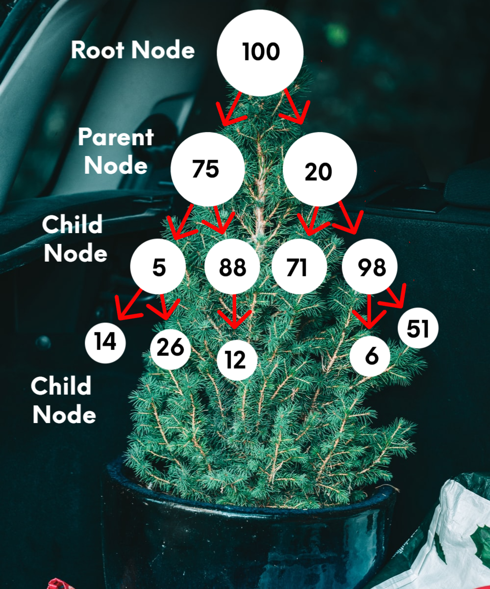
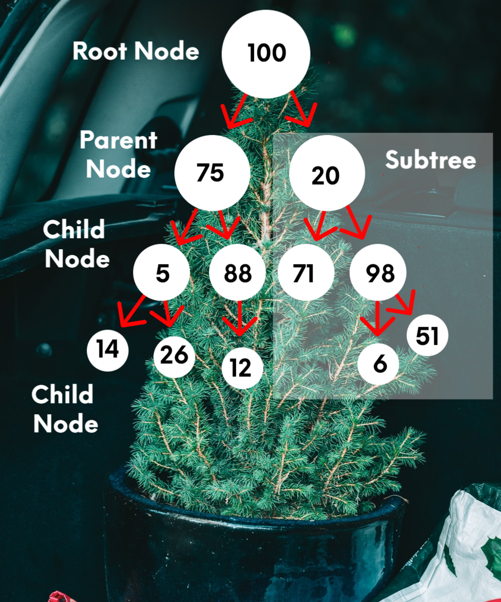

# Tree

## Introduction
A tree is a Data structure and is a special kind of linked list. What makes them special is that the nodes are connected by pointers in a hierarchical manner. A big difference from linked lists is that trees can be joined to multiple different nodes. Just like its name suggests, all the nodes or leaves are children of their parents nodes and all parent notes link up to the root node, forming a tree. 

## Parts of a Tree Data structure

**Root Node:** There is only one root node and it is located at the very top of the tree. Parent nodes are created from the one root node and all nodes connect up to the root node. 

**Parent Node:** There is one parent node which connects to the children nodes. Just like in families, the children can become parents, but a child can never be a parent to its parent node. 

**Child Node:** These nodes are below their parent node. 



From the above picture, here are some examples of the different nodes.
- Root Node: 100 (Only 1 Node)
- Parent Nodes: 75, 5 (Any node that has nodes undeeneath it.)
- Child Nodes: 5, 14 (Any node below a parent node. Child nodes can be parents also.)

## Binary tree
A binary tree is a balanced tree, which means that each parent node can have a maximum of 2 child nodes connected to it. It is perfectly fine to have or two, but they can't have 3 or more. Because of this, each parent has a left and right child node. The above picture is a binary tree. Notice, no more than two child notes per parent. 

## Balanced Binary Search Tree (BST)
What makes a balanced binary search tree (BST) is that the height between any two subtrees is not that much different. See the below image to see an example of a subtree, starting with 20 as the root node for the subtree.



So, the height of subtree starting with 20, is 3.

- Subtree Root Node 20 - Height Level 1
- Parent Nodes 71 and 98 - Height Level 2
- Child Nodes 6 and 51 - Height Level 3

What would the height of subtree 75 be?

- Subtree Root Node 75 - Height Level 1
- Parent Nodes 5 amd 88 - Height Level 2
- Child Nodes 14, 26 and 12 - Height Level 3

There are algorithms that can be used to identify if a tree is balanced or not and then correct it so it becomes balanced. The one that I will explain is AVL ((Adelson-Velskii and Landis). Subtree 20, is still balanced because children 6 and 51 are only hieght 2, but if we add 77 as a child to node 6, what would happen? Correct, it becomes unbalanced because its height would be 3. To correct this we would have to move it to node 71. 

## BST Operations
Due to the complicated operations of BST's we will disuss just inserting and traversing.

### INSERTING INTO A BST
This is an recursive operation, which means there is a base case and then the rest of the code. 

- Base Case: If the root node is empty the value is inserted.
- Other Code: It then can insert into the left or right side of the node.

Notice in the code below that there are two functions, **insert** and **_insert**. The insert is the function that we call to insert and the code will recrusively call the _insert function to find the best place to place the value.

```python
def insert(self, data):
	"""
	Insert 'data' into the BST.  If the BST
	is empty, then set the root equal to the new 
	node.  Otherwise, use _insert to recursively
	find the location to insert.
	"""
	if self.root is None:
		self.root = BST.Node(data)
	else:
		self._insert(data, self.root)  # Start at the root

def _insert(self, data, node):
	"""
	This function will look for a place to insert a node
	with 'data' inside of it.  The current subtree is
	represented by 'node'.  This function is intended to be
	called the first time by the insert function.
	"""
	if data < node.data:
		# The data belongs on the left side.
		if node.left is None:
			# We found an empty spot
			node.left = BST.Node(data)
		else:
			# Need to keep looking.  Call _insert
			# recursively on the left subtree.
			self._insert(data, node.left)
	elif data >= node.data:
		# The data belongs on the right side.
		if node.right is None:
			# We found an empty spot
			node.right = BST.Node(data)
		else:
			# Need to keep looking.  Call _insert
			# recursively on the right subtree.
			self._insert(data, node.right)
```

### TRAVERSING A BST
This is also a recursive operation to display all the values in a tree. We will be using the code to traverse the nodes from the smallest to largest.

- Base Case: If the subtree is empty, traverse recursively stops.
- Other Code: It will traverse from left and then the right subtree of the node. 

A couple things to note:
- The `__iter__` function is part of the Python framework and it allows us to get the next value in the BST.
- The yield command provides the next value to the for loop. It works like a return statement, except that it allows the function to pick up where it left off. 

```python
def __iter__(self):
	"""
    Perform a forward traversal (in order traversal) starting from 
    the root of the BST.  This is called a generator function.
    This function is called when a loop	is performed:

	for value in my_bst:
		print(value)

	"""
	yield from self._traverse_forward(self.root)  # Start at the root

def _traverse_forward(self, node):
	"""
	Does a forward traversal (in-order traversal) through the 
	BST.  If the node that we are given (which is the current
	subtree) exists, then we will keep traversing on the left
	side (thus getting the smaller numbers first), then we will 
	provide the data in the current node, and finally we will 
	traverse on the right side (thus getting the larger numbers last).

	The use of the 'yield' will allow this function to support loops
	like:

	for value in my_bst:
		print(value)

    The keyword 'yield' will return the value for the 'for' loop to
    use.  When the 'for' loop wants to get the next value, the code in
    this function will start back up where the last 'yield' returned a 
    value.  The keyword 'yield from' is used when our generator function
    needs to call another function for which a `yield` will be called.  
    In other words, the `yield` is delegated by the generator function
    to another function.

	This function is intended to be called the first time by 
	the __iter__ function.
	"""
	if node is not None:
		yield from self._traverse_forward(node.left)
		yield node.data
		yield from self._traverse_forward(node.right)
```

## Example
This example puts into action all the aspects of BST that we have covered. 

```python
'''
Example - BST 

These clases were copied from CSE 212 | Programming with Data Structures with permission from my instructor because support for BST has been discontinued. https://byui-cse.github.io/cse212-course/lesson09/09-prepare.html
'''

class BST:
    """
    Implement the Binary Search Tree (BST) data structure.  The Node 
    class below is an inner class.  An inner class means that its real 
    name is related to the outer class.  To create a Node object, we will 
    need to specify BST.Node
    """

    class Node:
        """
        Each node of the BST will have data and links to the 
        left and right sub-tree. 
        """

        def __init__(self, data):
            """ 
            Initialize the node to the data provided.  Initially
            the links are unknown so they are set to None.
            """
       
            self.data = data
            self.left = None
            self.right = None

    def __init__(self):
        """
        Initialize an empty BST.
        """
        self.root = None

    def insert(self, data):
        """
        Insert 'data' into the BST.  If the BST
        is empty, then set the root equal to the new 
        node.  Otherwise, use _insert to recursively
        find the location to insert.
        """
        
        if self.root is None:
            self.root = BST.Node(data)
        else:
            self._insert(data, self.root)  # Start at the root

    def _insert(self, data, node):
        """
        This function will look for a place to insert a node
        with 'data' inside of it.  The current sub-tree is
        represented by 'node'.  This function is intended to be
        called the first time by the insert function.
        """
        
        if data < node.data:
            # The data belongs on the left side.
            if node.left is None:
                # We found an empty spot
                node.left = BST.Node(data)
            else:
                # Need to keep looking.  Call _insert
                # recursively on the left sub-tree.
                self._insert(data, node.left)
        elif data > node.data: 
            # The data belongs on the right side.
            if node.right is None:
                # We found an empty spot
                node.right = BST.Node(data)
            else:
                # Need to keep looking.  Call _insert
                # recursively on the right sub-tree.
                self._insert(data, node.right)

    def __iter__(self):
        """
        Perform a forward traversal (in order traversal) starting from 
	    the root of the BST.  This is called a generator function.
        This function is called when a loop	is performed:

        for value in my_bst:
            print(value)
        """
        yield from self._traverse_forward(self.root)  # Start at the root
        
    def _traverse_forward(self, node):
        """
        Does a forward traversal (in-order traversal) through the 
        BST.  If the node that we are given (which is the current
        sub-tree) exists, then we will keep traversing on the left
        side (thus getting the smaller numbers first), then we will 
        provide the data in the current node, and finally we will 
        traverse on the right side (thus getting the larger numbers last).

        The use of the 'yield' will allow this function to support loops
        like:

        for value in my_bst:
            print(value)

        The keyword 'yield' will return the value for the 'for' loop to
	    use.  When the 'for' loop wants to get the next value, the code in
	    this function will start back up where the last 'yield' returned a 
	    value.  The keyword 'yield from' is used when our generator function
        needs to call another function for which a `yield` will be called.  
        In other words, the `yield` is delegated by the generator function
        to another function.

        This function is intended to be called the first time by 
        the __iter__ function.
        """
        if node is not None:
            yield from self._traverse_forward(node.left)
            yield node.data
            yield from self._traverse_forward(node.right)
        
    def __reversed__(self):
        """
        Perform a formward traversal (in order traversal) starting from 
        the root of the BST.  This function is called when a the 
        reversed function is called and is frequently used with a for
        loop.

        for value in reversed(my_bst):
            print(value)
        """        
        yield from self._traverse_backward(self.root)  # Start at the root

    def _traverse_backward(self, node):
        """
        Does a backwards traversal (reverse in-order traversal) through the 
        BST.  If the node that we are given (which is the current
        sub-tree) exists, then we will keep traversing on the right
        side (thus getting the larger numbers first), then we will 
        provide the data in the current node, and finally we will 
        traverse on the left side (thus getting the smaller numbers last).
    
        This function is intended to be called the first time by 
        the __reversed__ function.        
        """
        if node is not None:
            yield from self._traverse_backward(node.right)
            yield node.data
            yield from self._traverse_backward(node.left)
          
# Sample Test Cases (may not be comprehensive) 
print("=========== Inserting ===========")
tree = BST()
tree.insert(12)
tree.insert(20)
tree.insert(3)
# After implementing 'no duplicates' rule,
# this next insert will have no effect on the tree.
tree.insert(20)  
tree.insert(4)
tree.insert(10)
tree.insert(12)
tree.insert(6)
for x in tree:
    print(x)
# 3
# 4
# 6
# 10
# 12
# 20

print("\n=========== Search ===========")
print(5 in tree) # False
print(2 in tree) # False
print(20 in tree) # True
print(6 in tree) # True
print(9 in tree) # False

print("\n=========== Traverse in Reverse ===========")
for x in reversed(tree):
    print(x)  
# 20
# 12
# 10
# 6
# 4
# 3
```

## Problem to Solve
For this problem, your goal is to take an array and convert it into a balanced BST.

```python
'''
For this problem, your goal is to take an array and convert it into a balanced BST.
'''

class BST:
    """
    Implement the Binary Search Tree (BST) data structure.  The Node 
    class below is an inner class.  An inner class means that its real 
    name is related to the outer class.  To create a Node object, we will 
    need to specify BST.Node
    """

    class Node(object):
        """
        Each node of the BST will have data and links to the 
        left and right sub-array. 
        """

        def __init__(self, data):
            """ 
            Initialize the node to the data provided.  Initially
            the links are unknown so they are set to None.
            """
       
            self.data = data
            self.left = None
            self.right = None

    def __init__(self):
        """
        Initialize an empty BST.
        """
        self.root = None
        
def array_to_bst(array):
    
    # Enter your code here
    pass

def order(node): 
    if not node: 
        return      
    print(node.data)
    order(node.left) 
    order(node.right)   

print("=========== ARRAY 1 TESTS ===========")
array = [1,2,3,4,5,6,7,8,9,10,11,12,13]
print(array)
result = array_to_bst(array)
print("\nArray to a height balanced BST:")
print(order(result))
'''
Expected Results:
[1, 2, 3, 4, 5, 6, 7, 8, 9, 10, 11, 12, 13]

Array to a height balanced BST:
7
4
2
1
3
6
5
11
9
8
10
13
12
None
'''

print("\n=========== ARRAY 2 TESTS ===========")
array1 = [10, 20, 30, 40, 50, 60]
print(array1)
result1 = array_to_bst(array1)
print("\nArray to a height balanced BST:")
print(order(result1))
'''
Expected Results:
[10, 20, 30, 40, 50, 60]

Array to a height balanced BST:
40
20
10
30
60
50
None
'''

print("\n=========== ARRAY 3 TESTS ===========")
array2 = [x for x in range(25)]
print(array2)
result2 = array_to_bst(array2)
print("\nArray to a height balanced BST:")
print(order(result2))
'''
Expected Results:
[0, 1, 2, 3, 4, 5, 6, 7, 8, 9, 10, 11, 12, 13, 14, 15, 16, 17, 18, 19, 20, 21, 22, 23, 24]

Array to a height balanced BST:
12
6
3
1
0
2
5
4
9
8
7
11
10
19
16
14
13
15
18
17
22
21
20
24
23
None
'''
```

You can check your code with the solution here: [Solution](/t-problem_solution.py)

[Back to Welcome Page](/0-welcome.md)